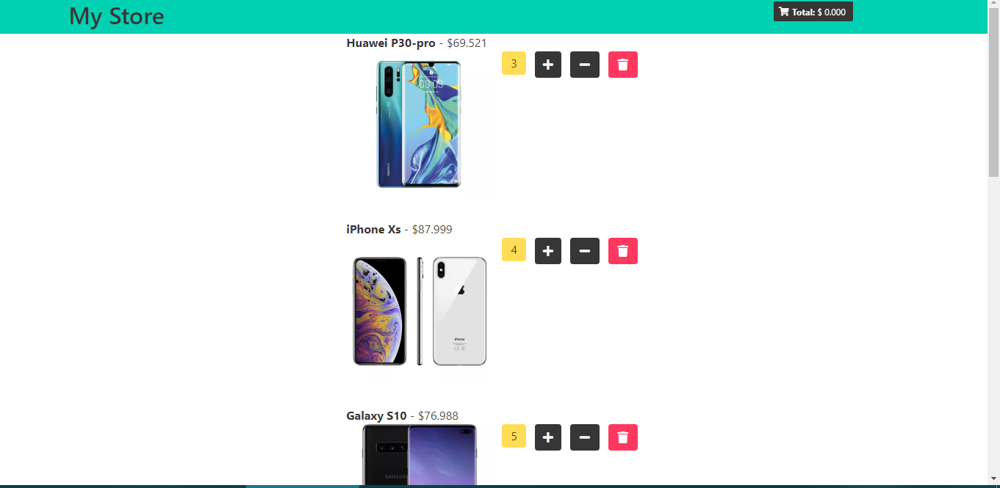

# vistaTiendaVirtual
En este proyecto se muestra una pagina principal en cual se listan una serie de productos, (celulares), con sus respectivos precios y stock... (cargados de forma estática al azar). Permitiendo al cliente poder agregar los productos a un carrito de compras. El proyecto fue realizado con Javascipt utilizando la libreria React, Css3,Html5, Nodejs.

INICIALIZANDO EL PROYECTO

1) Descargar el codigo, clonar el repositorio.
2) Abrir una nueva consola cmd en el caso de windows ubicarse dentro de la carpeta con el projecto.
3) Instalar los modulos de nodejs, ejecutando el comando: npm install
4) Una vez instalados los archivos de punto 3), ejecturar el comando: npm start
